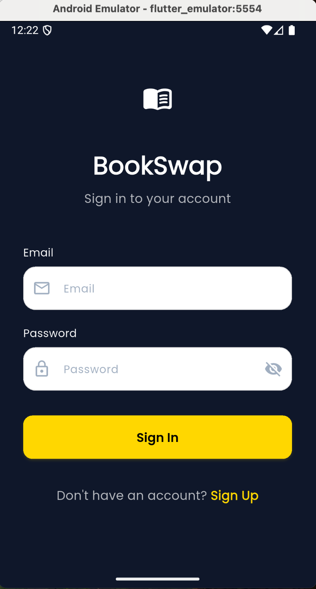
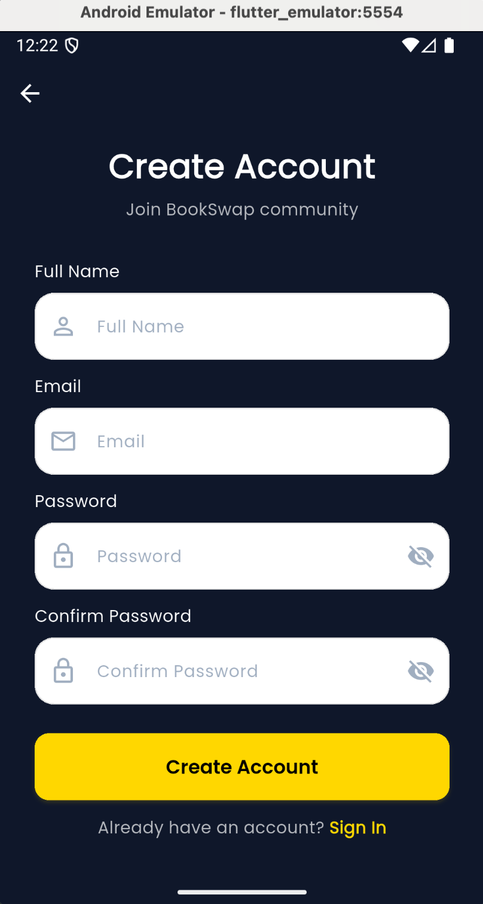
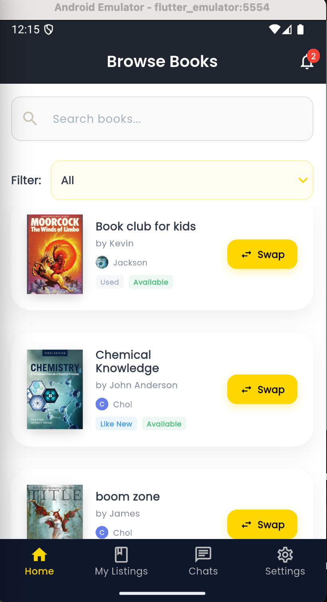
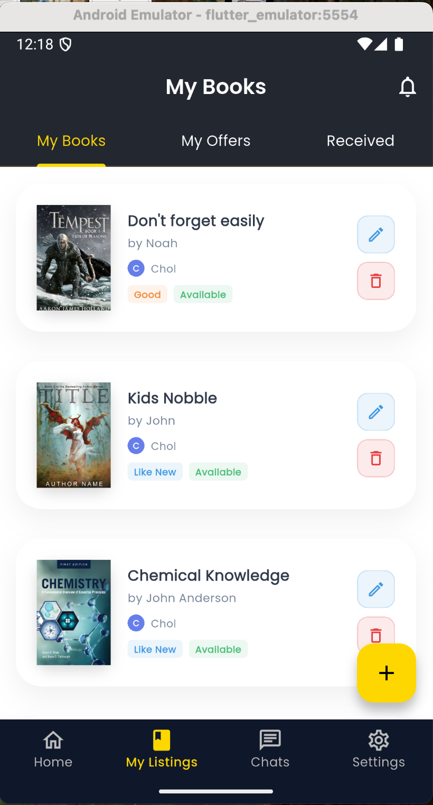
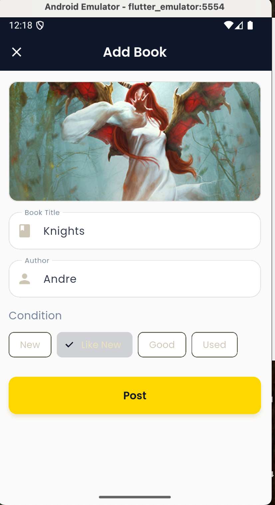
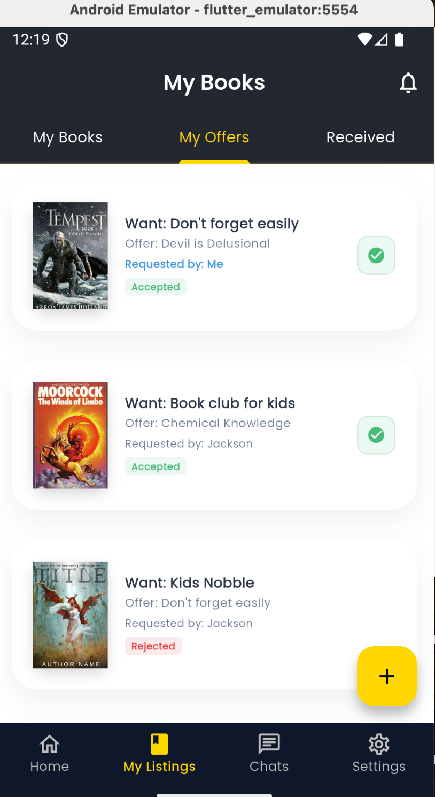
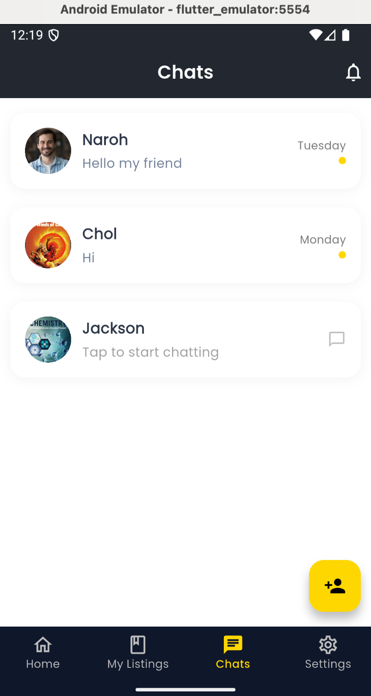
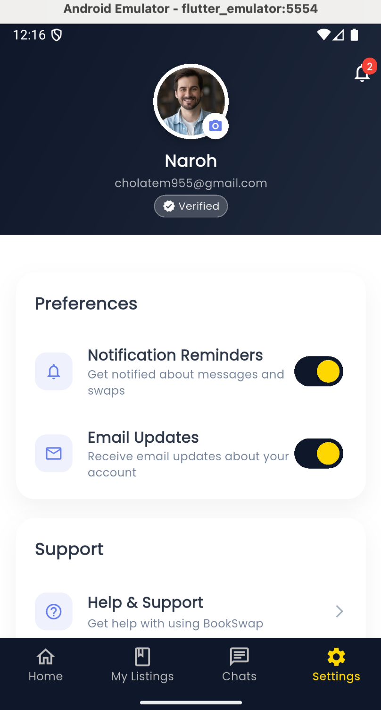
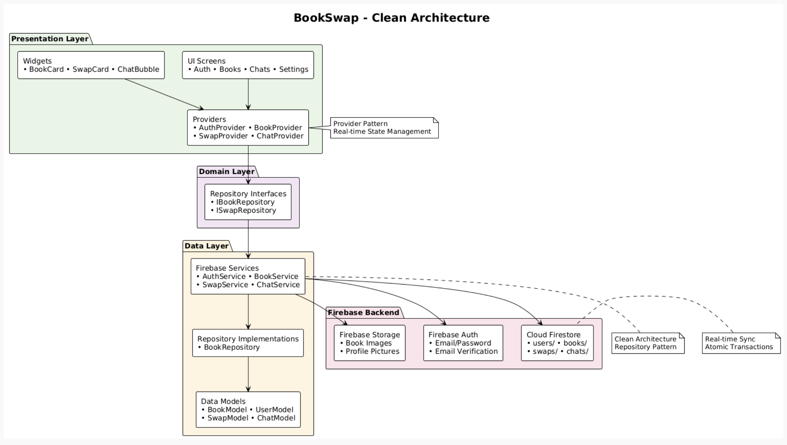

# BookSwap - Student Textbook Exchange App

A professional Flutter application for students to exchange textbooks with each other. Built with Firebase backend, clean architecture principles, and comprehensive state management using Provider pattern.

## Project Overview

BookSwap is a full-stack mobile application that enables students to list, browse, and exchange textbooks through a secure swap system. The app features real-time chat functionality, comprehensive CRUD operations, and seamless Firebase integration for authentication, data storage, and real-time synchronization.

## Screenshots

<div align="center">
  
  
  
  
</div>

<div align="center">
  
  
  
  
</div>

## Demo Video

🎥 **[Watch Full Demo Video](https://drive.google.com/file/d/11QjqqPDBejNTiaDyRQpOQ2r1XcQ2XF_h/view?usp=sharing)**

The demo video (7-12 minutes) showcases the complete BookSwap functionality including:
- Authentication flow with email verification
- CRUD operations for book management
- Real-time swap system with state updates
- Live chat functionality
- Firebase console integration demonstrating real-time synchronization

## System Architecture

<div align="center">
  
</div>

The BookSwap application follows **Clean Architecture** principles with clear separation of concerns across four distinct layers. The **Presentation Layer** contains UI screens for authentication, book management, chats, and settings, along with reusable widgets and state providers that implement the Provider pattern for reactive state management. The **Domain Layer** serves as an abstraction with repository interfaces that define contracts for data operations. The **Data Layer** houses Firebase services, repository implementations, and data models that handle business logic and data transformation. Finally, the **Firebase Backend** provides authentication, real-time database storage, and file storage capabilities. This architecture ensures maintainable, testable code with real-time synchronization across all users through Firestore streams and Provider pattern state management.

### Project Structure

The application follows Clean Architecture folder organization:
```
lib/
├── core/
│   ├── constants/     # App-wide constants
│   └── theme/         # App theme and styling
├── data/
│   ├── models/        # Data models (BookModel, UserModel, etc.)
│   ├── repositories/  # Repository implementations
│   └── services/      # Firebase services
├── domain/
│   └── repositories/  # Repository interfaces
└── presentation/
    ├── providers/     # State management (Provider pattern)
    ├── screens/       # UI screens organized by feature
    │   ├── auth/      # Authentication screens
    │   ├── books/     # Book management screens
    │   ├── chats/     # Chat functionality
    │   ├── home/      # Main navigation
    │   ├── notifications/ # Notification management
    │   ├── settings/  # App settings
    │   └── users/     # User management
    └── widgets/       # Reusable UI components
```

### Architecture Features

- **Clean Architecture**: Clear separation between presentation, domain, and data layers
- **Provider Pattern**: Reactive state management with real-time UI updates
- **Repository Pattern**: Abstraction layer between business logic and data sources
- **Firebase Integration**: Real-time synchronization across all users
- **CRUD Operations**: Complete Create, Read, Update, Delete functionality
- **Real-time Chat**: Live messaging with Firestore subcollections
- **Atomic Transactions**: Consistent data updates using Firestore transactions
- **Email Verification**: Secure authentication with enforced email verification

## Database Schema

The application uses Firebase Firestore with the following collections:

#### Users Collection
Stores user profile information and preferences.

**Collection Path**: `/users/{userId}`

```json
{
  "email": "cholnaroh1@gmail.com",
  "name": "Jackson",
  "profileImageUrl": "assets/images/bookcover5.jpg",
  "emailVerified": true,
  "createdAt": 1762524028885,
  "notificationsEnabled": true,
  "emailUpdatesEnabled": true
}
```


#### Books Collection
Stores textbook listings with owner information and availability status.

**Collection Path**: `/books/{bookId}`

```json
{
  "title": "Introduction to Algorithms",
  "author": "Thomas H. Cormen",
  "condition": "Like New",
  "imageUrl": "https://firebasestorage.googleapis.com/...",
  "ownerId": "GQY7PZpNEXb9geNnTmUerBHr60x2",
  "ownerName": "Jackson",
  "createdAt": 1762524028885,
  "isAvailable": true,
  "pendingRequests": ["6mRZKWd4seYdUbKwesojgTKLxAp1"]
}
```

**Condition Options**: `New`, `Like New`, `Good`, `Used`

#### Swaps Collection
Manages book exchange requests and their status.

**Collection Path**: `/swaps/{swapId}`

```json
{
  "targetBookId": "book123",
  "targetBookTitle": "Introduction to Algorithms",
  "targetBookImageUrl": "https://firebasestorage.googleapis.com/...",
  "offeredBookId": "book456",
  "offeredBookTitle": "Data Structures and Algorithms",
  "offeredBookImageUrl": "https://firebasestorage.googleapis.com/...",
  "requesterId": "6mRZKWd4seYdUbKwesojgTKLxAp1",
  "requesterName": "Alice Johnson",
  "ownerId": "GQY7PZpNEXb9geNnTmUerBHr60x2",
  "ownerName": "Jackson",
  "status": "pending",
  "createdAt": 1762524028885,
  "updatedAt": 1762524128885
}
```

**Status Options**: `pending`, `accepted`, `rejected`

#### Chats Collection
Real-time messaging system for users after swap initiation.

**Collection Path**: `/chats/{chatId}`

```json
{
  "participants": [
    "GQY7PZpNEXb9geNnTmUerBHr60x2",
    "6mRZKWd4seYdUbKwesojgTKLxAp1"
  ],
  "participantNames": ["Jackson", "Alice Johnson"],
  "lastMessage": "Hi! Is the book still available?",
  "lastMessageTime": 1762524228885,
  "swapId": "swap123"
}
```

#### Messages Subcollection
Individual messages within each chat.

**Collection Path**: `/chats/{chatId}/messages/{messageId}`

```json
{
  "senderId": "GQY7PZpNEXb9geNnTmUerBHr60x2",
  "senderName": "Jackson",
  "message": "Yes, it's available! Would you like to swap?",
  "timestamp": 1762524328885
}
```

#### Notifications Collection
System notifications for swap updates and messages.

**Collection Path**: `/notifications/{notificationId}`

```json
{
  "userId": "GQY7PZpNEXb9geNnTmUerBHr60x2",
  "type": "swap_request",
  "title": "New Swap Request",
  "message": "Alice Johnson wants to swap for your book",
  "read": false,
  "createdAt": 1762524028885,
  "relatedId": "swap123"
}
```

**Notification Types**: `swap_request`, `swap_accepted`, `swap_rejected`, `message`

## Key Features

### Authentication
- Email/password signup and login with Firebase Auth
- Email verification enforcement
- User profile management with profile pictures
- Secure logout functionality

### Book Management (CRUD)
- **Create**: Add books with title, author, condition, and cover image
- **Read**: Browse all available books in real-time
- **Update**: Edit your own book listings
- **Delete**: Remove books from your listings
- Image upload to Firebase Storage

### Swap System
- Book-for-book exchange requests
- Real-time swap status updates (Pending, Accepted, Rejected)
- Automatic book availability management
- Comprehensive swap history tracking

### Chat System
- Real-time messaging between users
- Chat creation after swap requests
- Message history persistence in Firestore
- Modern chat UI with timestamps

### Navigation & UI
- Bottom navigation with 4 screens: Browse, My Books, Chats, Settings
- Material Design 3 UI with dark theme
- Responsive and intuitive interface

## State Management

**Provider Pattern** implementation with:
- Reactive state updates across all screens
- Real-time Firestore stream listeners
- Separation of concerns with dedicated providers:
  - `AuthProvider` - Authentication state
  - `BookProvider` - Book CRUD operations
  - `SwapProvider` - Swap functionality
  - `ChatProvider` - Real-time messaging
  - `NotificationProvider` - Notifications and settings
  - `FormProvider` - Form state management for StatelessWidget architecture

### How to Implement Provider Pattern

1. **Setup MultiProvider in main.dart:**
```dart
MultiProvider(
  providers: [
    ChangeNotifierProvider(create: (_) => AuthProvider()),
    ChangeNotifierProvider(create: (_) => BookProvider()),
    // ... other providers
  ],
  child: MaterialApp(...)
)
```

2. **Create Provider Classes:**
```dart
class BookProvider extends ChangeNotifier {
  List<BookModel> _books = [];
  
  void addBook(BookModel book) {
    _books.add(book);
    notifyListeners(); // Updates all listening widgets
  }
}
```

3. **Consume in Widgets:**
```dart
Consumer<BookProvider>(
  builder: (context, bookProvider, child) {
    return ListView.builder(
      itemCount: bookProvider.books.length,
      itemBuilder: (context, index) => BookCard(book: bookProvider.books[index]),
    );
  },
)
```

## Firebase Configuration & Setup

### Step 1: Create Firebase Project
1. Go to [Firebase Console](https://console.firebase.google.com/)
2. Click "Create a project" or "Add project"
3. Enter project name: `bookswap-education`
4. Enable Google Analytics (optional)
5. Click "Create project"

### Step 2: Enable Firebase Services

**Authentication Setup:**
1. Navigate to Authentication > Sign-in method
2. Enable "Email/Password" provider
3. Configure email verification:
   - Go to Authentication > Templates
   - Customize email verification template
   - Enable "Email link (passwordless sign-in)" if desired

**Firestore Database Setup:**
1. Navigate to Firestore Database
2. Click "Create database"
3. Choose "Start in production mode"
4. Select database location (closest to your users)
5. Configure security rules:

```javascript
rules_version = '2';
service cloud.firestore {
  match /databases/{database}/documents {
    // Users can read/write their own data
    match /users/{userId} {
      allow read, write: if request.auth != null && request.auth.uid == userId;
    }
    
    // Books are readable by all authenticated users
    match /books/{bookId} {
      allow read: if request.auth != null;
      allow write: if request.auth != null && request.auth.uid == resource.data.ownerId;
    }
    
    // Swaps are accessible by participants
    match /swaps/{swapId} {
      allow read, write: if request.auth != null && 
        (request.auth.uid == resource.data.requesterId || 
         request.auth.uid == resource.data.ownerId);
    }
    
    // Chats are accessible by participants
    match /chats/{chatId} {
      allow read, write: if request.auth != null && 
        request.auth.uid in resource.data.participants;
      
      match /messages/{messageId} {
        allow read, write: if request.auth != null && 
          request.auth.uid in get(/databases/$(database)/documents/chats/$(chatId)).data.participants;
      }
    }
  }
}
```

**Firebase Storage Setup:**
1. Navigate to Storage
2. Click "Get started"
3. Configure security rules:

```javascript
rules_version = '2';
service firebase.storage {
  match /b/{bucket}/o {
    match /users/{userId}/{allPaths=**} {
      allow read, write: if request.auth != null && request.auth.uid == userId;
    }
    match /books/{allPaths=**} {
      allow read: if request.auth != null;
      allow write: if request.auth != null;
    }
  }
}
```

### Step 3: Add Firebase to Flutter Project

1. **Install FlutterFire CLI:**
   ```bash
   dart pub global activate flutterfire_cli
   ```

2. **Configure Firebase for your project:**
   ```bash
   flutterfire configure
   ```
   - Select your Firebase project
   - Choose platforms (iOS, Android, Web, macOS, Windows)
   - This generates `firebase_options.dart`

3. **Download configuration files:**
   - **Android**: Download `google-services.json` → `android/app/`
   - **iOS**: Download `GoogleService-Info.plist` → `ios/Runner/`

### Step 4: Update Platform Configuration

**Android Configuration:**
Add Google Services plugin to `android/app/build.gradle.kts`

**iOS Configuration:**
Ensure bundle identifier matches Firebase project configuration.

## Installation & Build Steps

### Prerequisites
- Flutter SDK (3.9.2 or higher)
- Dart SDK (3.0.0 or higher)
- Android Studio / VS Code with Flutter extensions
- Xcode (for iOS development)
- Firebase CLI (optional, for Functions)

### Step-by-Step Installation

1. **Clone the Repository**
   ```bash
   git clone https://github.com/Chol1000/individual_assignment_2.git
   cd individual_assignment_2
   ```

2. **Install Flutter Dependencies**
   ```bash
   flutter pub get
   ```

3. **Firebase Configuration**
   - Ensure `firebase_options.dart` is configured for your project
   - Verify `google-services.json` is in `android/app/`
   - Verify `GoogleService-Info.plist` is in `ios/Runner/`

4. **Verify Flutter Installation**
   ```bash
   flutter doctor
   ```
   Ensure all checkmarks are green for your target platform.

5. **Run the Application**
   
   **For Android:**
   ```bash
   flutter run -d android
   ```
   
   **For iOS:**
   ```bash
   flutter run -d ios
   ```
   
   **For specific device:**
   ```bash
   flutter devices  # List available devices
   flutter run -d <device-id>
   ```

6. **Build for Production**
   
   **Android APK:**
   ```bash
   flutter build apk --release
   ```
   
   **iOS IPA:**
   ```bash
   flutter build ios --release
   ```

### Troubleshooting Common Issues

**Firebase Configuration:**
- Ensure package names match between Firebase console and Android configuration
- Verify bundle identifiers match for iOS

**Build Issues:**
- Run `flutter clean && flutter pub get`
- For iOS: `cd ios && pod install`
- Minimum SDK: Android 21+, iOS 11+

## Dependencies

### Core Firebase Dependencies
```yaml
dependencies:
  firebase_core: ^2.24.2          # Firebase initialization
  firebase_auth: ^4.15.3          # Authentication services
  cloud_firestore: ^4.13.6        # Firestore database
  firebase_storage: ^11.5.6       # File storage
```

### State Management & UI
```yaml
  provider: ^6.1.1                # State management
  google_fonts: ^6.1.0            # Typography
  cached_network_image: ^3.3.0    # Image caching
  image_picker: ^1.0.4            # Camera/gallery access
```

### Utility Dependencies
```yaml
  intl: ^0.18.1                   # Date/time formatting
  uuid: ^4.2.1                    # Unique ID generation
  path_provider: ^2.1.1           # File system paths
```


## Key Implementation Details

### State Management Strategy
- **Provider Pattern** for reactive state management
- **Stream-based updates** from Firestore for real-time sync
- **Separation of concerns** with dedicated providers for each feature
- **Error handling** with user-friendly messages

### Real-time Features
- **Live book listings** update instantly across all users
- **Swap status changes** reflect immediately for both parties
- **Chat messages** appear in real-time
- **Notification system** with instant updates

### Security Implementation
- **Email verification** enforced before app access
- **User data isolation** with proper Firestore security rules
- **Image upload** with user-specific paths
- **Authentication state** persistence across app restarts

### UI/UX Design
- **Material Design 3** with custom dark theme
- **Responsive layouts** for different screen sizes
- **Intuitive navigation** with bottom navigation bar
- **Professional styling** with consistent color scheme
- **Error states** and loading indicators

## Testing & Quality Assurance

### Dart Analyzer Report
Run the Dart analyzer to check for code quality issues:

```bash
flutter analyze
```

**Expected Result**: Zero warnings and errors

**Sample Output:**
```
Analyzing individual_assignment_2...
No issues found! (ran in 2.3s)
```

### Build Verification

**Debug Build:**
```bash
flutter build apk --debug
```

**Release Build:**
```bash
flutter build apk --release
```

**iOS Build:**
```bash
flutter build ios --debug
```


---

**Developer**: Chol Naroh  
**Course**: Mobile App Development  
**Assignment**: Individual Assignment 2  
**GitHub Repository**: https://github.com/Chol1000/individual_assignment_2